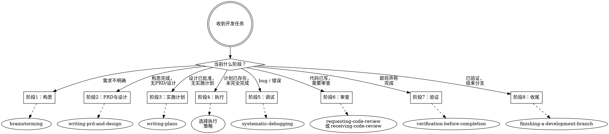

# 编码 — 开发全生命周期管理

## 概述

**所有开发任务首先进入这里。** 此技能识别当前开发阶段并路由到适当的子技能。永远不要直接跳到实现技能 — 始终先确定阶段。

**核心原则：** 在正确的时间使用正确的技能。每个阶段都有对应的技能。

## 开发原则

以下四条原则贯穿所有阶段的所有开发工作。不可妥协。

### 1. 先思考再编码
不要假设。不要隐藏困惑。暴露权衡。

在实现之前：
- 明确陈述你的假设。如果不确定，就问。
- 如果存在多种理解，呈现出来 — 不要默默选择。
- 如果有更简单的方法，说出来。必要时予以反驳。
- 如果有不明白的地方，停下来。指出困惑之处。提问。

### 2. 简洁优先
用最少的代码解决问题。不做任何投机性编码。

- 不添加超出需求的功能。
- 不为一次性代码创建抽象。
- 不添加未要求的"灵活性"或"可配置性"。
- 不处理不可能发生的错误场景。
- 如果你写了 200 行但 50 行就能搞定，重写它。
- 问自己："资深工程师会觉得这太复杂了吗？" 如果是，简化它。

### 3. 精准修改
只动必须动的。只清理自己弄乱的。

编辑现有代码时：
- 不要"改进"相邻的代码、注释或格式。
- 不要重构没有坏的东西。
- 匹配现有风格，即使你会用不同方式。
- 如果发现无关的死代码，提及它 — 不要删除它。

当你的修改产生了孤立代码时：
- 移除你的修改导致的无用导入/变量/函数。
- 不要移除之前就存在的死代码，除非被要求。

**检验标准：** 每一行改动都应该能直接追溯到用户的请求。

### 4. 目标驱动执行
定义成功标准。循环直到验证通过。

将任务转化为可验证的目标：
- "添加验证" → "为无效输入编写测试，然后让它们通过"
- "修复 bug" → "编写一个复现它的测试，然后让它通过"
- "重构 X" → "确保重构前后测试都通过"

对于多步骤任务，陈述简要计划：
```
1. [步骤] → 验证：[检查]
2. [步骤] → 验证：[检查]
3. [步骤] → 验证：[检查]
```

强的成功标准让你可以独立循环。弱的标准（"让它能用"）需要不断澄清。

**这些原则生效的标志：** diff 中不必要的改动更少，过度复杂导致的重写更少，澄清性问题在实现之前提出而非在犯错之后。

### 5. Hyrum's Law（海勒姆定律）
> "当你的 API 有足够多的用户时，你在合同中承诺的一切都不重要：你系统的所有可观测行为都将被某人所依赖。"

含义：
- 不要仅仅依赖类型系统来保证安全
- 行为的每个细节都是公共 API
- 即使是"未记录的行为"也会被依赖
- 重构时考虑下游影响

### 6. Chesterton's Fence（钱斯特勒顿之篱）
> "在拆除栅栏之前，首先理解为什么它被建造。"

含义：
- 不要删除你不理解的东西
- 如果代码看起来愚蠢，可能有你不知道的原因
- 在重构前先理解现有设计
- 问："为什么这是这样？" 而不只是 "这能更好吗？"

### 7. 测试金字塔
```
        /\
       /  \     E2E 测试（少量，昂贵）
      /----\
     /      \   集成测试（适量）
    /--------\
   /          \  单元测试（大量，便宜，快速）
  /------------\
```

原则：
- 70% 单元测试
- 20% 集成测试
- 10% E2E 测试
- 测试越贵越少，越便宜越多

### 8. Beyoncé 规则
> "如果喜欢你，我就该保护我（If you liked it, then you shoulda put a Ring on it）"

含义：
- 如果你喜欢一个工具/库/框架，就应该投入保护它的努力
- 贡献文档、测试、修复 bug
- 不要只是消费者，做贡献者

### 9. 左移原则（Shift Left）
- 在开发周期中越早发现问题，修复成本越低
- 质量门控应该尽可能靠近代码编写
- 验证 → 测试 → 集成测试 → 部署
- 早发现 = 便宜修复，晚发现 = 昂贵修复

### 10. 二八定律在代码审查中
- 80% 的问题来自 20% 的代码区域
- 重点审查：复杂逻辑、边界条件、错误处理
- 简单代码快速通过，复杂代码深入审查

## 阶段路由流程图



## 阶段 → 技能路由

### 阶段1：构思与设计
**时机：** 尚无设计，或需求不明确。
**路由到：** `brainstorming`
**输出：** 批准的设计要点 → 自动转入阶段2。

### 阶段2：PRD 与详细设计
**时机：** 构思完成，需要 PRD 和详细设计文档。
**路由到：** `writing-prd-and-design`
**输出：** PRD 文档 + 详细设计文档 → 自动转入阶段3。

### 阶段3：实施计划
**时机：** PRD 和详细设计已批准，需要实施计划。
**路由到：** `writing-plans`
**输出：** 实施计划保存至 `docs/plans/`。

### 阶段4：执行
**时机：** 计划已存在，任务需要实施。

| 情况 | 路由到 |
|------|--------|
| 同一会话，独立任务 | `subagent-driven-development` |
| 独立会话，批量执行 | `executing-plans` |
| 多个并行任务 | `dispatching-parallel-agents` |

**执行期间还应应用：**
- `test-driven-development` — 每个任务的 TDD 纪律
- `using-git-worktrees` — 在工作树中隔离开发
- `using-uv` — 使用 uv 管理 Python 包

### 阶段5：调试
**时机：** 遇到 bug、出现错误、或测试意外失败。
**路由到：** `systematic-debugging`

### 阶段6：代码审查
**时机：** 代码已编写，需要审查。

| 情况 | 路由到 |
|------|--------|
| 请求他人审查 | `requesting-code-review` |
| 接收并处理审查反馈 | `receiving-code-review` |

### 阶段7：验证
**时机：** 即将声称工作已完成、已修复或已通过。
**路由到：** `verification-before-completion`
**强制性：** 没有最新证据就不能声称完成。

### 阶段8：分支收尾
**时机：** 工作已验证，准备合并/关闭。
**路由到：** `finishing-a-development-branch`

## 快速决策表

| 你听到... | 阶段 | 技能 |
|-----------|------|------|
| "构建 X" / "添加功能" / "创建" | 1 | brainstorming |
| "构思完成，写 PRD 和设计" | 2 | writing-prd-and-design |
| "设计已批准，做实施计划" | 3 | writing-plans |
| "按这个计划做" / "执行任务 N" | 4 | subagent-driven-development |
| "修复这个 bug" / "错误：..." | 5 | systematic-debugging |
| "审查这段代码" / "PR 反馈" | 6 | requesting/receiving-code-review |
| "完成了吗？" / "应该没问题了" | 7 | verification-before-completion |
| "合并这个" / "结束分支" | 8 | finishing-a-development-branch |

## 规则

1. **任何开发任务始终先通过此技能路由。**
2. **绝不跳过阶段。** 如果没有设计，从阶段1开始 — 即使任务"看起来很简单"。
3. **阶段可以重复。** 调试可能回到执行，审查可能回到调试。
4. **任何完成声称之前，验证是强制性的。** 没有例外。
5. **宣布阶段和技能：** "阶段 [N]：[名称] — 使用 [skill-name]"

## 反模式

- ❌ 不经设计直接编码
- ❌ 没有计划就实施
- ❌ 执行时跳过 TDD
- ❌ 不运行验证就声称"完成"
- ❌ 不经代码审查就合并
- ❌ "这太简单了不需要设计"
- ❌ 只写正例测试，忽略反例和边界值（违反铁律一）
- ❌ 单元测试覆盖率未达 100% 且未标注原因（违反铁律二）
- ❌ 集成测试只写正例，缺少反例/边界值或未自动化（违反铁律三）

## 借口反驳表

| 借口 | 反驳 |
|------|------|
| "这太简单了不需要设计" | 简单项目正是未经审查假设导致最多浪费工作的地方。设计可以简短，但必须展示并获得批准。 |
| "测试太费时间，先上线再说" | 没有测试的代码是负债而非资产。修复 bug 的时间会远超写测试的时间。 |
| "这只是个临时方案" | 临时方案往往会成为永久方案。在写之前先问：值得写吗？ |
| "这只是小改动，不需要审查" | 最大的 bug 通常来自"小改动"。审查是质量门控，不是流程负担。 |
| "运行没问题，我测试过了" | 你测试的是 happy path。用户会走边界条件和错误路径。 |
| "这个代码太旧了，不用管" | 遗留代码是业务知识的沉淀。Chesterton's Fence：如果不理解为什么它在那里，不要移除它。 |
| "以后再写测试" | 测试立即通过什么都证明不了。先测试回答"这应该做什么？"，后测试回答"这做什么？"。 |
| "手动测试就够了" | 手动测试是临时的。没有记录，无法重新运行，压力下容易遗漏。 |

## 子技能参考

## 文件结构

```
skills/coding-skills/
├── SKILL.md                              ← 本文件
├── workflows/                            ← 子技能工作流文档（中文）
│   ├── brainstorming.md                   ← 阶段1：构思
│   ├── writing-prd-and-design.md         ← 阶段2：PRD与详细设计
│   ├── writing-plans.md                   ← 阶段3：实施计划
│   ├── subagent-driven-development.md     ← 阶段4：子代理执行
│   ├── executing-plans.md                 ← 阶段4：批量执行
│   ├── dispatching-parallel-agents.md     ← 阶段4：并行任务
│   ├── test-driven-development.md         ← 阶段4：测试驱动开发
│   ├── using-git-worktrees.md             ← 阶段4：Git Worktree隔离
│   ├── using-uv.md                        ← 阶段4：Python uv包管理
│   ├── systematic-debugging.md            ← 阶段5：调试
│   ├── requesting-code-review.md          ← 阶段6：请求审查
│   ├── receiving-code-review.md           ← 阶段6：处理反馈
│   ├── verification-before-completion.md  ← 阶段7：验证
│   └── finishing-a-development-branch.md   ← 阶段8：分支收尾
└── references/                           ← 辅助参考文件
    ├── python-async-patterns.md           ← Python 异步开发实战模式
    ├── requesting-code-review-code-reviewer.md
    ├── subagent-driven-development-*.md
    ├── systematic-debugging-*.md/.ts/.sh
    └── test-driven-development-testing-anti-patterns.md
```

| 技能 | 阶段 | 用途 |
|------|------|------|
| brainstorming | 1 | 需求 → 设计要点 |
| writing-prd-and-design | 2 | 设计要点 → PRD + 详细设计 |
| writing-plans | 3 | 详细设计 → 实施计划 |
| subagent-driven-development | 4 | 用子代理执行计划 |
| executing-plans | 4 | 批量执行计划 |
| dispatching-parallel-agents | 4 | 执行并行任务 |
| test-driven-development | 4 | TDD 纪律 + 正例/反例/边界值 + 覆盖率 |
| using-git-worktrees | 4 | 隔离开发 |
| using-uv | 4 | Python uv 包管理器 |
| systematic-debugging | 5 | 根因调试 |
| requesting-code-review | 6 | 请求审查 |
| receiving-code-review | 6 | 处理审查反馈 |
| verification-before-completion | 7 | 声称前需证据 |
| finishing-a-development-branch | 8 | 合并/关闭分支 |

**参考文件：**

| 文件 | 用途 |
|------|------|
| references/python-async-patterns.md | Python 异步开发实战模式（阻塞 I/O、SSE 流式、deque 滑动窗口、持久连接） |
| references/test-driven-development-testing-anti-patterns.md | 测试反模式 |
