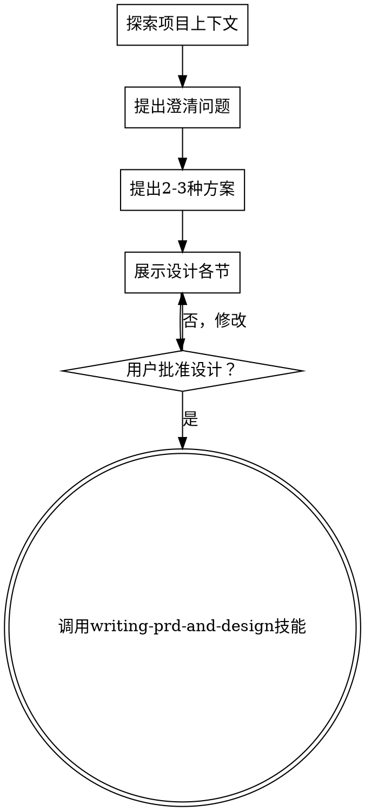

# 将想法头脑风暴为设计

## 概述

通过自然的协作对话，帮助将想法转化为完整的设计和规格。

首先了解当前项目上下文，然后逐一提问来细化想法。一旦理解了要构建什么，展示设计并获得用户批准。

<HARD-GATE>
在展示设计并获得用户批准之前，不得调用任何实现技能、编写任何代码、搭建任何项目或采取任何实现行动。这适用于每个项目，无论看起来多么简单。
</HARD-GATE>

## 反模式："这太简单了不需要设计"

每个项目都要经过这个过程。一个待办列表、一个单函数工具、一个配置更改——全都一样。"简单"项目正是未经审查的假设导致最多浪费工作的地方。设计可以简短（对真正简单的项目只需几句话），但你必须展示它并获得批准。

## 检查清单

你必须为以下每一项创建任务并按顺序完成：

1. **探索项目上下文** — 检查文件、文档、最近的提交
2. **提出澄清问题** — 一次一个，理解目的/约束/成功标准
3. **提出 2-3 种方案** — 包含权衡和你的推荐
4. **展示设计** — 按复杂度分节展示，每节后获得用户批准
5. **撰写设计文档和PRD** — 调用 writing-prd-and-design 技能保存设计文档和PRD
6. **过渡到实现** — 遵循 writing-prd-and-design 技能的输出

## 流程图

**终止状态是调用 writing-prd-and-design。** 不要调用 frontend-design、mcp-builder 或任何其他实现技能。头脑风暴后唯一调用的技能是 writing-prd-and-design。

## 流程

**理解想法：**
- 首先检查当前项目状态（文件、文档、最近提交）
- 一次问一个问题来细化想法
- 尽可能使用选择题，但开放式也可以
- 每条消息只问一个问题——如果一个话题需要更多探索，拆分成多个问题
- 重点关注：目的、约束、成功标准

**探索方案：**
- 提出 2-3 种不同的方案及其权衡
- 以对话方式展示选项，给出你的推荐和理由
- 首先展示推荐选项并解释原因

**展示设计：**
- 一旦你认为理解了要构建什么，展示设计
- 按复杂度分节：简单的几句话，复杂的 200-300 字
- 每节后问是否看起来正确
- 涵盖：架构、组件、数据流、错误处理、测试
- 如果有不明白的地方，随时回去澄清

**设计检查点（在展示设计时逐项确认）：**
- **测试策略**：正例/反例/边界值三维度覆盖，覆盖率目标 100%，集成测试自动化

## 设计之后

**文档化：**
- 将头脑风暴结果整理为设计要点，保存到临时文件
- 如果可用，使用 elements-of-style:writing-clearly-and-concisely 技能

**实现：**
- 调用 writing-prd-and-design 技能创建 PRD 和详细设计文档
- 不要调用任何其他技能。writing-prd-and-design 是下一步。

## 关键原则

- **一次一个问题** — 不要用多个问题淹没用户
- **优先选择题** — 可能的话比开放式更容易回答
- **严格执行 YAGNI** — 从所有设计中移除不必要的功能
- **探索替代方案** — 在确定之前总是提出 2-3 种方案
- **增量验证** — 展示设计，在继续之前获得批准
- **保持灵活** — 有不明白的地方随时回去澄清
