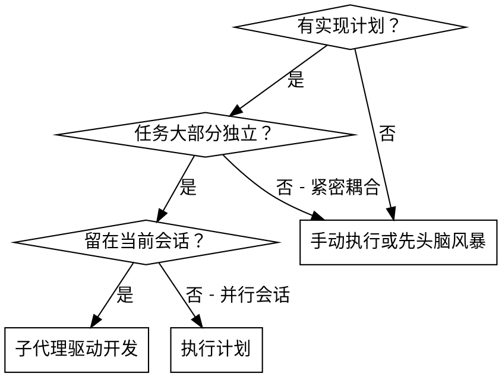
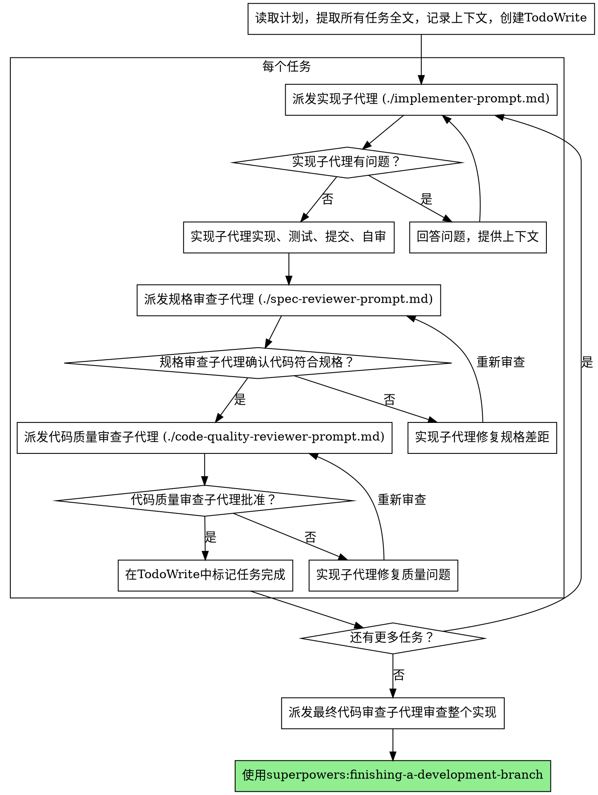

# 子代理驱动开发

通过为每个任务派发全新子代理来执行计划，每个任务后进行两阶段审查：先是规格合规审查，再是代码质量审查。

**核心原则：** 每个任务使用新子代理 + 两阶段审查（规格然后质量）= 高质量、快迭代

## 何时使用



**vs. 执行计划（并行会话）：**
- 同一会话（无上下文切换）
- 每个任务使用新子代理（无上下文污染）
- 每个任务后两阶段审查：先规格合规，再代码质量
- 更快的迭代（任务间无需人工介入）

## 流程



## 提示模板

- `./implementer-prompt.md` - 派发实现子代理
- `./spec-reviewer-prompt.md` - 派发规格合规审查子代理
- `./code-quality-reviewer-prompt.md` - 派发代码质量审查子代理

## 示例工作流

```
你：我正在使用子代理驱动开发来执行这个计划。

[一次性读取计划文件：docs/plans/feature-plan.md]
[提取所有 5 个任务的全文和上下文]
[创建包含所有任务的 TodoWrite]

任务 1：Hook 安装脚本

[获取任务 1 文本和上下文（已提取）]
[派发实现子代理，附带完整任务文本 + 上下文]

实现者："在开始之前 - hook 应该安装在用户级还是系统级？"

你："用户级（~/.config/superpowers/hooks/）"

实现者："明白了。现在开始实现..."
[稍后] 实现者：
  - 实现了 install-hook 命令
  - 添加了测试，5/5 通过
  - 自审：发现遗漏了 --force 标志，已添加
  - 已提交

[派发规格合规审查者]
规格审查者：✅ 规格合规 - 满足所有需求，无多余内容

[获取 git SHA，派发代码质量审查者]
代码审查者：优点：测试覆盖良好，代码整洁。问题：无。批准。

[标记任务 1 完成]

任务 2：恢复模式

[获取任务 2 文本和上下文（已提取）]
[派发实现子代理，附带完整任务文本 + 上下文]

实现者：[没有问题，直接进行]
实现者：
  - 添加了 verify/repair 模式
  - 8/8 测试通过
  - 自审：一切正常
  - 已提交

[派发规格合规审查者]
规格审查者：❌ 问题：
  - 缺失：进度报告（规格说"每 100 项报告一次"）
  - 多余：添加了 --json 标志（未要求）

[实现者修复问题]
实现者：移除了 --json 标志，添加了进度报告

[规格审查者再次审查]
规格审查者：✅ 现在规格合规了

[派发代码质量审查者]
代码审查者：优点：稳健。问题（重要）：魔法数字 (100)

[实现者修复]
实现者：提取了 PROGRESS_INTERVAL 常量

[代码审查者再次审查]
代码审查者：✅ 批准

[标记任务 2 完成]

...

[所有任务之后]
[派发最终代码审查者]
最终审查者：满足所有需求，可以合并

完成！
```

## 优势

**vs. 手动执行：**
- 子代理自然遵循 TDD
- 每个任务全新上下文（无混淆）
- 并行安全（子代理不互相干扰）
- 子代理可以提问（工作前和工作期间）

**vs. 执行计划：**
- 同一会话（无交接）
- 持续进展（无需等待）
- 审查检查点自动化

**效率收益：**
- 无文件读取开销（控制器提供全文）
- 控制器精确策划所需上下文
- 子代理预先获得完整信息
- 问题在工作开始前暴露（而非之后）

**质量门禁：**
- 自审在交接前发现问题
- 两阶段审查：规格合规，然后代码质量
- 审查循环确保修复确实有效
- 规格合规防止过度/不足构建
- 代码质量确保实现质量优良

**成本：**
- 更多子代理调用（每个任务 1 个实现者 + 2 个审查者）
- 控制器做更多准备工作（预先提取所有任务）
- 审查循环增加迭代
- 但提前发现问题（比事后调试更便宜）

## 红线

**绝不：**
- 未经用户明确同意在 main/master 分支上开始实现
- 跳过审查（规格合规或代码质量）
- 有未修复问题时继续
- 并行派发多个实现子代理（会冲突）
- 让子代理读取计划文件（改为提供全文）
- 跳过场景设定上下文（子代理需要理解任务的位置）
- 忽略子代理的问题（在让它们继续之前回答）
- 对规格合规接受"差不多"（规格审查者发现问题 = 未完成）
- 跳过审查循环（审查者发现问题 = 实现者修复 = 再次审查）
- 让实现者自审取代实际审查（两者都需要）
- **在规格合规 ✅ 之前开始代码质量审查**（顺序错误）
- 在任一审查有未解决问题时进入下一个任务

**如果子代理提问：**
- 清晰完整地回答
- 如需要提供额外上下文
- 不要催促它们进入实现

**如果审查者发现问题：**
- 实现者（同一子代理）修复它们
- 审查者再次审查
- 重复直到批准
- 不要跳过重新审查

**如果子代理任务失败：**
- 派发修复子代理并附带具体指令
- 不要尝试手动修复（上下文污染）

## 集成

**必需的工作流技能：**
- **superpowers:using-git-worktrees** - 必需：开始前设置隔离工作空间
- **superpowers:writing-plans** - 创建此技能执行的计划
- **superpowers:requesting-code-review** - 审查子代理的代码审查模板
- **superpowers:finishing-a-development-branch** - 所有任务完成后完成开发

**子代理应使用：**
- **superpowers:test-driven-development** - 子代理对每个任务遵循 TDD

**替代工作流：**
- **superpowers:executing-plans** - 用于并行会话而非同会话执行
