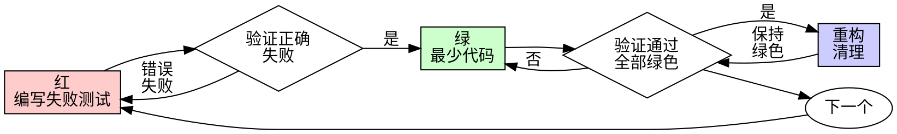

# 测试驱动开发（TDD）

## 概述

先写测试。看它失败。写最少代码让它通过。

**核心原则：** 如果你没有看到测试失败，你不知道它测试的是否正确。

**违反规则的字面意思就是违反规则的精神。**

## 何时使用

**总是：**
- 新功能
- Bug 修复
- 重构
- 行为变更

**例外（需征得人类搭档同意）：**
- 一次性原型
- 生成代码
- 配置文件

在想"就这次跳过 TDD"？停下。那是合理化。

## 铁律

```
没有失败的测试就不能写生产代码
```

先写代码再写测试？删除它。从头开始。

**没有例外：**
- 不要保留它作为"参考"
- 不要在写测试时"适配"它
- 不要看它
- 删除就是删除

从测试出发重新实现。就这样。

## 红-绿-重构



### 红 - 编写失败测试

编写一个最小测试展示应该发生什么。

<好>
```typescript
test('重试失败操作 3 次', async () => {
  let attempts = 0;
  const operation = () => {
    attempts++;
    if (attempts < 3) throw new Error('fail');
    return 'success';
  };

  const result = await retryOperation(operation);

  expect(result).toBe('success');
  expect(attempts).toBe(3);
});
```
名称清晰，测试真实行为，一件事
</好>

<坏>
```typescript
test('retry works', async () => {
  const mock = jest.fn()
    .mockRejectedValueOnce(new Error())
    .mockRejectedValueOnce(new Error())
    .mockResolvedValueOnce('success');
  await retryOperation(mock);
  expect(mock).toHaveBeenCalledTimes(3);
});
```
名称含糊，测试 mock 而非代码
</坏>

**要求：**
- 一个行为
- 清晰的名称
- 真实代码（除非不可避免否则不用 mock）

### 验证红 - 看它失败

**必须执行。绝不跳过。**

```bash
npm test path/to/test.test.ts
```

确认：
- 测试失败（而非报错）
- 失败消息是预期的
- 因为功能缺失而失败（而非拼写错误）

**测试通过了？** 你在测试已有行为。修改测试。

**测试报错了？** 修复错误，重新运行直到正确失败。

### 绿 - 最少代码

编写最简单的代码让测试通过。

<好>
```typescript
async function retryOperation<T>(fn: () => Promise<T>): Promise<T> {
  for (let i = 0; i < 3; i++) {
    try {
      return await fn();
    } catch (e) {
      if (i === 2) throw e;
    }
  }
  throw new Error('unreachable');
}
```
刚好够通过
</好>

<坏>
```typescript
async function retryOperation<T>(
  fn: () => Promise<T>,
  options?: {
    maxRetries?: number;
    backoff?: 'linear' | 'exponential';
    onRetry?: (attempt: number) => void;
  }
): Promise<T> {
  // YAGNI
}
```
过度工程
</坏>

不要添加功能、重构其他代码或"改进"超出测试范围的部分。

### 验证绿 - 看它通过

**必须执行。**

```bash
npm test path/to/test.test.ts
```

确认：
- 测试通过
- 其他测试仍然通过
- 输出干净（无错误、警告）

**测试失败了？** 修复代码，不是测试。

**其他测试失败？** 立即修复。

### 重构 - 清理

只在绿色之后：
- 移除重复
- 改善命名
- 提取辅助函数

保持测试绿色。不要添加行为。

### 重复

为下一个功能编写下一个失败测试。

## 好的测试

| 质量 | 好的 | 坏的 |
|------|------|------|
| **最小化** | 一件事。名称中有"和"？拆分它。 | `test('验证邮箱和域名和空格')` |
| **清晰** | 名称描述行为 | `test('test1')` |
| **展示意图** | 演示期望的 API | 遮蔽代码应该做什么 |

## 为什么顺序重要

**"我之后写测试来验证它有效"**

之后写的测试立即通过。立即通过什么都证明不了：
- 可能测试了错误的东西
- 可能测试了实现而非行为
- 可能遗漏了你忘记的边界情况
- 你从未看到它捕获 bug

先写测试迫使你看到测试失败，证明它确实测试了什么。

**"我已经手动测试了所有边界情况"**

手动测试是临时的。你以为测试了所有东西但：
- 没有记录你测试了什么
- 代码变更时无法重新运行
- 压力下容易忘记情况
- "我试的时候没问题" ≠ 全面

自动化测试是系统化的。它们每次以相同方式运行。

**"删除 X 小时的工作是浪费"**

沉没成本谬误。时间已经过去了。你现在的选择：
- 删除并用 TDD 重写（再 X 小时，高信心）
- 保留它并在之后添加测试（30 分钟，低信心，可能有 bug）

"浪费"是保留你无法信任的代码。没有真正测试的工作代码是技术债。

**"TDD 是教条主义的，务实意味着适应"**

TDD 就是务实的：
- 在提交前发现 bug（比之后调试更快）
- 防止回归（测试立即捕获破坏）
- 记录行为（测试展示如何使用代码）
- 启用重构（自由更改，测试捕获破坏）

"务实"的捷径 = 在生产中调试 = 更慢。

**"之后测试达到同样目标 - 是精神不是仪式"**

不。后测试回答"这做什么？"先测试回答"这应该做什么？"

后测试受你的实现偏见。你测试你构建的，而非所需的。你验证记住的边界情况，而非发现的。

先测试迫使在实现前发现边界情况。后测试验证你记住了一切（你没有）。

30 分钟的后测试 ≠ TDD。你获得了覆盖率，失去了测试有效的证明。

## 常见合理化

| 借口 | 现实 |
|------|------|
| "太简单不需要测试" | 简单代码也会坏。测试只需 30 秒。 |
| "我之后测试" | 测试立即通过什么都证明不了。 |
| "后测试达到同样目标" | 后测试 = "这做什么？" 先测试 = "这应该做什么？" |
| "已经手动测试过了" | 临时 ≠ 系统化。无记录，无法重新运行。 |
| "删除 X 小时是浪费" | 沉没成本谬误。保留未验证代码是技术债。 |
| "保留作为参考，先写测试" | 你会适配它。那是后测试。删除就是删除。 |
| "需要先探索" | 可以。扔掉探索，从 TDD 开始。 |
| "测试难 = 设计不清" | 倾听测试。难测试 = 难使用。 |
| "TDD 会让我变慢" | TDD 比调试更快。务实 = 先测试。 |
| "手动测试更快" | 手动无法证明边界情况。每次更改都要重新测试。 |
| "现有代码没有测试" | 你在改进它。为现有代码添加测试。 |

## 红线 - 停下并从头开始

- 先写代码再写测试
- 实现后写测试
- 测试立即通过
- 无法解释为什么测试失败
- "稍后"添加测试
- 合理化"就这次"
- "我已经手动测试过了"
- "后测试达到同样目的"
- "是精神不是仪式"
- "保留作为参考"或"适配现有代码"
- "已经花了 X 小时，删除是浪费"
- "TDD 是教条主义的，我很务实"
- "这不同因为..."

**所有这些意味着：删除代码。用 TDD 从头开始。**

## 示例：Bug 修复

**Bug：** 空邮箱被接受

**红**
```typescript
test('拒绝空邮箱', async () => {
  const result = await submitForm({ email: '' });
  expect(result.error).toBe('Email required');
});
```

**验证红**
```bash
$ npm test
FAIL: expected 'Email required', got undefined
```

**绿**
```typescript
function submitForm(data: FormData) {
  if (!data.email?.trim()) {
    return { error: 'Email required' };
  }
  // ...
}
```

**验证绿**
```bash
$ npm test
PASS
```

**重构**
如果需要，为多个字段提取验证。

## 验证检查清单

在标记工作完成之前：

- [ ] 每个新函数/方法都有测试
- [ ] 在实现之前看到每个测试失败
- [ ] 每个测试因预期原因失败（功能缺失，而非拼写错误）
- [ ] 为每个测试编写了最少代码让它通过
- [ ] 所有测试通过
- [ ] 输出干净（无错误、警告）
- [ ] 测试使用真实代码（除非不可避免否则不用 mock）
- [ ] 覆盖了边界情况和错误

无法勾选所有框？你跳过了 TDD。从头开始。

## 卡住时

| 问题 | 解决方案 |
|------|---------|
| 不知道怎么测试 | 写期望的 API。先写断言。问人类搭档。 |
| 测试太复杂 | 设计太复杂。简化接口。 |
| 必须模拟一切 | 代码太耦合。使用依赖注入。 |
| 测试设置庞大 | 提取辅助函数。仍然复杂？简化设计。 |

## 调试集成

发现 bug？编写复现它的失败测试。遵循 TDD 循环。测试证明修复并防止回归。

绝不没有测试就修复 bug。

## 测试反模式

添加 mock 或测试工具时，阅读 @testing-anti-patterns.md 避免常见陷阱：
- 测试 mock 行为而非真实行为
- 向生产类添加仅测试方法
- 在不理解依赖的情况下 mock

## 最终规则

```
生产代码 → 存在测试且测试先失败了
否则 → 不是 TDD
```

未经人类搭档许可没有例外。
